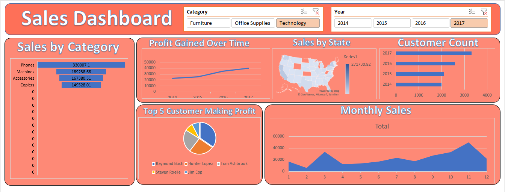
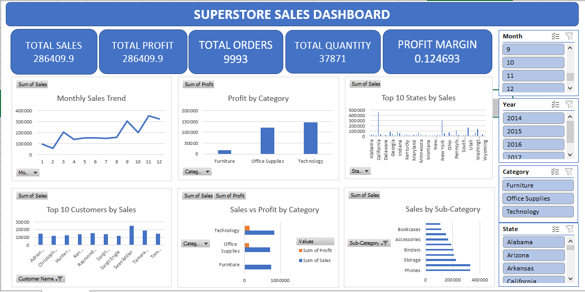

# 📊 Superstore Sales Dashboard

An interactive and professional Microsoft Excel dashboard designed to analyze Superstore sales performance using Pivot Tables, Pivot Charts, KPI Cards, Slicers, and advanced data visualization techniques.

---

## 📸 Dashboard Preview

### Main Dashboard

### Interactive Dashboard View

---

## 📌 Project Overview

This project transforms raw Superstore sales data into an interactive business dashboard that helps analyze sales performance, customer behavior, product categories, and regional trends. Users can filter data dynamically using slicers and instantly view updated insights.

---

## 🚀 Dashboard Features

- 📈 Monthly Sales Trend Analysis
- 💰 Profit by Category
- 🗺️ Top 10 States by Sales
- 👥 Top 10 Customers by Sales
- 📦 Sales by Sub-Category
- 📊 Sales vs Profit (Combo Chart)
- 🎯 KPI Cards
  - Total Sales
  - Total Profit
  - Total Orders
  - Total Quantity
  - Profit Margin
- 🎛️ Interactive Slicers
  - Year
  - Month
  - Category
  - State

---

## 🛠 Tools & Skills Used

- Microsoft Excel 2021
- Pivot Tables
- Pivot Charts
- Slicers
- Dashboard Design
- Data Cleaning
- Data Visualization
- Business Intelligence
- Excel Formulas

---

## 📂 Project Files

| File | Description |
|------|-------------|
| salesdata.xlsx | Interactive Excel Dashboard |
| salesdata.csv | Raw Dataset |
| Capture.PNG | Dashboard Screenshot |
| Capture1.PNG | Dashboard Preview |
| README.md | Project Documentation |

---

## 📊 Business Insights

- Identify top-performing states by sales.
- Analyze monthly sales trends.
- Compare profit across product categories.
- Discover top customers by revenue.
- Evaluate product sub-category performance.
- Filter the dashboard dynamically using slicers.

---

## 🎯 Learning Outcomes

This project demonstrates practical skills in:

- Excel Dashboard Development
- Business Data Analysis
- KPI Reporting
- Interactive Reporting
- Data Visualization
- Decision Support Dashboard Design

---

## ⭐ About This Project

This dashboard was created as part of my Data Analytics portfolio to demonstrate practical Excel dashboard development skills using real-world business data.

If you like this project, don't forget to ⭐ Star this repository.
